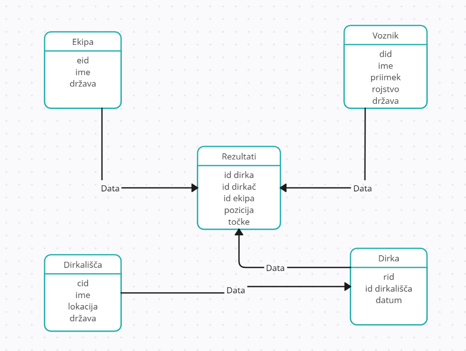

# Formula-1-skozi-as

Formula 1 je največji razred motošporta, kot ga označuje FIA krovna avtomobilistična organizacija. Formula 1 vsebuje serijo dirk, na kateri nastopajo dirkači z najnaprednejši avtomobili. Namen najinega projekta je analizirati Formulo 1 skozi čas. Zanima naju s kolikšnem denarjem se ta šport ukvarja in koliko tega denarja gre v razvoj dirkalnika. Zanima naju kakšno vlogo odigra dirkač. Ali je boljši tisti dirkač z več izkušnjami ali z manj? Ali pa je na koncu vse odvisno le od dirkalnika? Hranila bova bazo podatkov iz posameznih sezon. V njej bodo hranjeni podatki: kot so npr: dirkač, dirkalnik, uvrstitev, najhitrejši krogi itd... (primerjava dirkačev med seboj)

## Načrt  projekta
1. Pridobivanje podatkov
2. Podatki urejeni v bazo
3. Spletni vmesnik za prikazovanje teh podatkov

## ER-diagram baze

## ČLANA RAZVOJA EKIPE
Žiga Avbreht in Polona Fajdiga

## POVEZAVE DO PODATKOV
- https://www.kaggle.com/datasets/rohanrao/formula-1-world-championship-1950-2020
- https://www.formula1.com/

